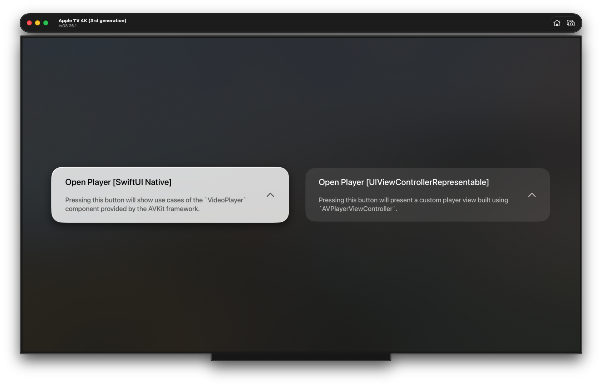
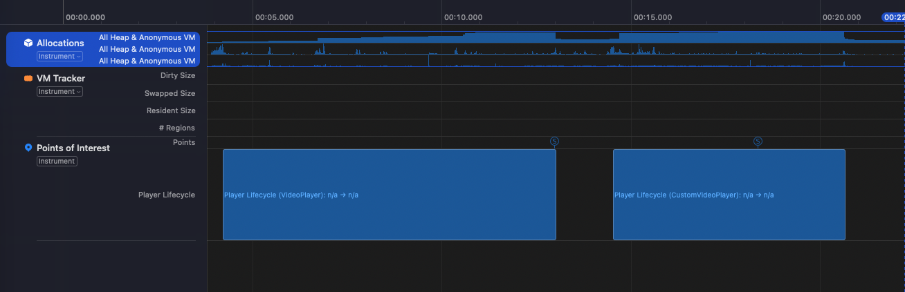
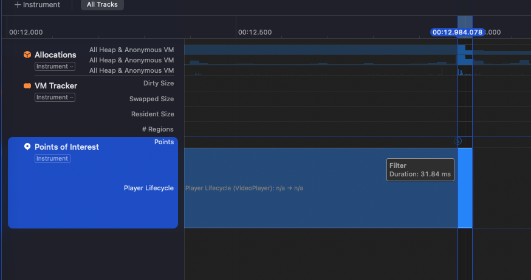
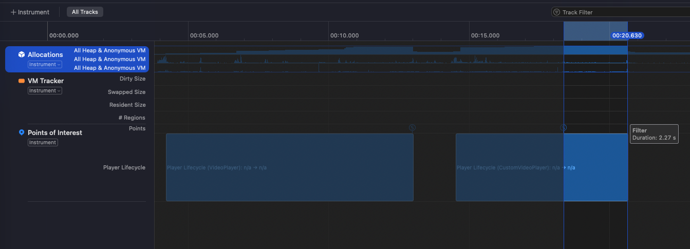

# Audio Leak When Dismissing AVPlayerViewController Embedded in UIViewControllerRepresentable on tvOS (FB21111697)

## Description

There is an audio leak issue on tvOS when using a custom video player built with `UIViewControllerRepresentable` and `AVPlayerViewController`.

When presenting a SwiftUI view embedding `AVPlayerViewController` and dismissing it immediately after playback starts, the underlying `AVPlayer` instance is not deallocated immediately, causing audio to continue playing for several seconds after the view has been dismissed.

This issue does not occur when using the native SwiftUI `VideoPlayer` component from AVKit.

To demonstrate the issue, a custom `Player` class has been created inheriting from `AVPlayer` and added `OSSignposter` instrumentation. Instruments confirm that the player remains alive and continues to output audio briefly after dismissal.

This results in a noticeable audio leak, especially when users start the playback and exit immediately.

## Steps to Reproduce

1. Run the demo project.
2. Tap "Open Player [UIViewControllerRepresentable]".
3. The player view appears.
4.	Start the content (using the remote control play button, or if you're on a simulator, by pressing Enter or Space).
5. Immediately dismiss the player (using the remote control back button, or if you're on a simulator, by pressing Esc).

> Note: The SwiftUI `onDisappear` is called correctly, but the underlying `AVPlayer` instance is not released immediately.
>
> 

## Expected Result

As soon as the SwiftUI view embedding `AVPlayerViewController` disappears, its associated `AVPlayer` should be deallocated immediately and no audio should be heard once the player view is dismissed.

## Actual Result

- After the view containing the `AVPlayerViewController` is dismissed, the `AVPlayer` instance remains alive for few seconds.
- Audio continues playing.

> Note: 
> Instruments trace confirms delayed deallocation of the `AVPlayer` instance.
> The range of interest starts from the `AVPlayer` initialization and ends when the player is deallocated. The duration shown below starts when the view disappears and ends when the player is deallocated.
>
> | VideoPlayer (31.84 ms) | CustomVideoPlayer (2.27s) |
> |-----------|-----------------
> |||

## Configuration

- **OS Version**: tvOS 16 up to tvOS 26.1
- **Devices**: Apple TV HD, Apple TV 4K, Simulators
- **Xcode Version**: 26.1.0
- [Demo Project](https://github.com/waliid/issues/tree/main/CustomPlayerViewAudioLeak)

## Remarks

- The issue does not occur when using `VideoPlayer` from AVKit.
- Appears to be specific to embedding `AVPlayerViewController` using SwiftUI’s `UIViewControllerRepresentable`.
- The delayed deallocation leads to audio artifacts and may indicate a retain cycle or cleanup delay internally in tvOS's AVPlayerViewController lifecycle.
